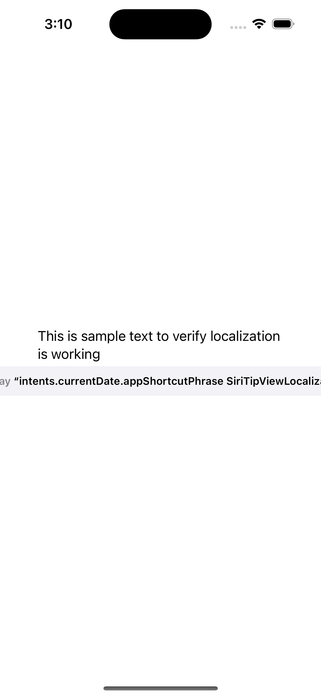

# SiriTipView Localization Issue

I'm clearly doing something wrong here.

This code (the first commit, at least. I hope I'll remember to update this once I figure out/am told the issue) demonstrates an apparent issue (lack of understanding on my part? Lack of documentation?) with localizing App Intents and using SiriTip(UI)View.

As far as I can tell, if you localize your AppShortcuts.strings file, then SiriTipView does not use the localized shortcut name in the text it displays. Instead, it shows the name of the localized string key.

Also, the text does not wrap. Which definitely feels like a bug as even short phrases, especially when localized into other languages, will likely cause text wrapping. Especially on smaller screens.

This is an issue because it's a best practice to use namespaced localized string keys. For example, I use keys like "home.button.run" as the string's key. There's an old [this objc.io article on String Localization that covers this](https://www.objc.io/issues/9-strings/string-localization/). 

This bug is reproducible with both the SwiftUI SiriTipView, as well as the UIKit SiriTipUIView.

Interesting, the siritipview was showing the correct string prior to me clicking "Localize" on AppShortcuts.strings. But once I clicked "localized" and AppShortcuts.strings was moved into en.lproj, I saw this bug.
